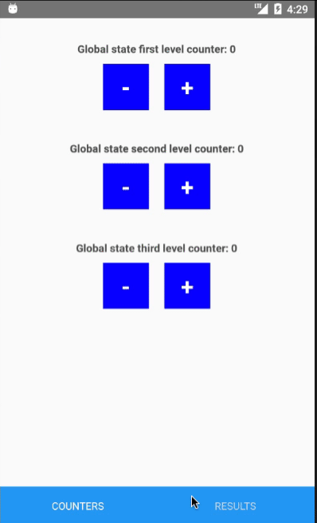

I've created this project to show one technique that I developed to replace the use of redux as global state management  in React Native.

This technique do not needs any third party module, just React-Native code, but i use the react-navigation módulo to show that`s works globaly, and may be used to pass props betwen screens if your project is using react-navigations 

To get start read the GetStartGuide.md file.

I hope you guys enjoy.
Fell free to send suggest.
